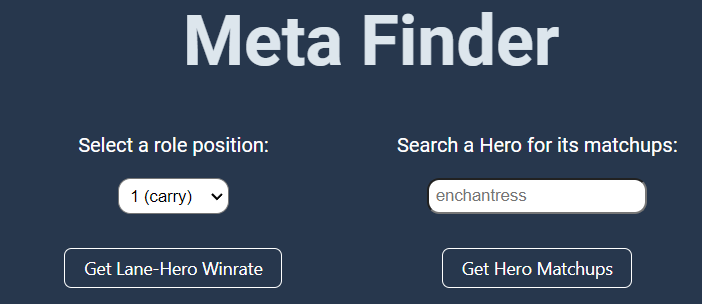
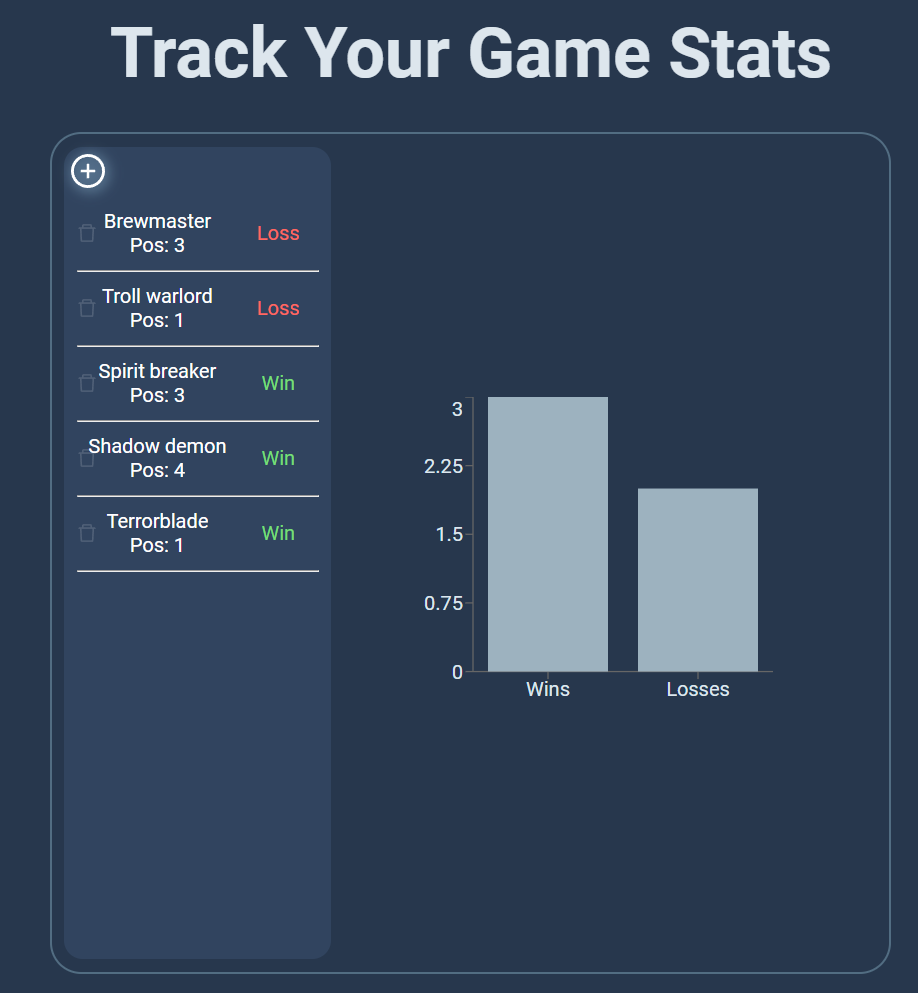
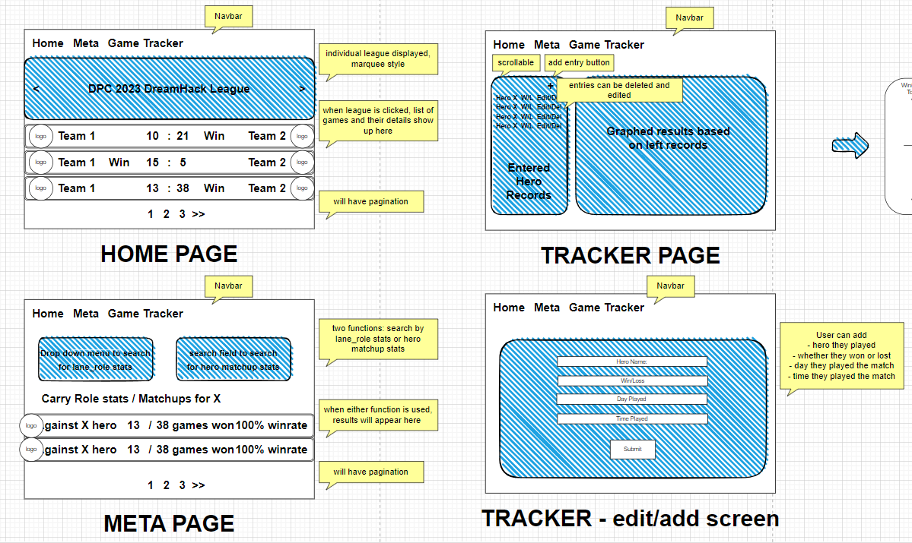

# dota2tracker
A tracking application for dota 2's Esports scene

* View different dota pro leagues in 2023 and their respective match results
* Search the Meta for different heroes in different lane positions and different heroes' matchup winrates
* Save games you have played and track your win-loss ratio

# Screenshot(s)

# Wireframes

# Technologies Used
* HTML, CSS and Javascript
* React

# APIs Used
* https://docs.opendota.com/#section/Introduction
* https://ant.design/components/overview
* https://recharts.org/en-US/
* https://airtable.com/

# Getting Started
Visit https://dota2tracker.vercel.app/ and start using the features straight away!

# Credits
* https://www.freepik.com/author/starline for background pattern
